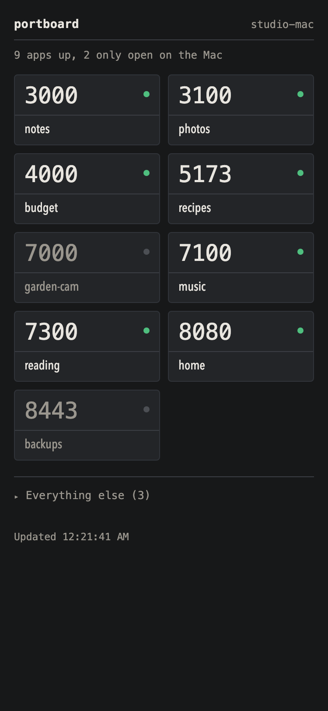

# portboard

A zero-dependency Node page that lists your Mac's listening ports as tappable
links, so you can jump straight to a local app from your phone on the same
network or tailnet.



## Run it

```sh
./install.sh     # writes a LaunchAgent (com.carlitos.portboard); starts at login, restarts if it crashes
./uninstall.sh   # stops it and removes the LaunchAgent
```

Logs go to `~/Library/Logs/portboard.log`. On your phone (same wifi), open
`http://<your-mac>.local:7777` — `install.sh` prints the exact URL. On the Mac
itself it's `http://localhost:7777`. Away from home, the same address works
over Tailscale on your tailnet.

## How it decides what's up

Each jack has a lamp. It's lit when the port is bound to something other than
loopback — a wildcard bind or a specific LAN/Tailscale interface — meaning
your phone can actually reach it. It's unlit when the server only answers on
`127.0.0.1`, which means it's alive on the Mac but the phone can't open it (a
dev server started without a host flag is the usual culprit). A curated set
of ports sits in a grid up top; everything else lands in a collapsed "Everything
else" list underneath, same lamps.

## Naming your ports

`APP_NAMES` in `server.js` maps a port number to the name shown on its jack.
Edit that map to name your own projects; a port not listed there falls back to
its project folder name (for anything running under `PORTBOARD_WORKSPACE`,
default `~/workspace`), then to the process name.

## Tips

- Dev servers that bind localhost only (e.g. `next dev`) won't be reachable
  from the phone. Start them with `-H 0.0.0.0` (or the equivalent host flag).
- Set `PORTBOARD_PORT` to run the dashboard on a different port than 7777.
- Nothing is exposed to the public internet: the dashboard only listens on
  the Mac's local interfaces, reachable from your home LAN and your Tailscale
  tailnet.

## Demo mode

Set `PORTBOARD_DEMO=1` to serve a fixed, fictional list instead of scanning the machine. The screenshots above come from it.
